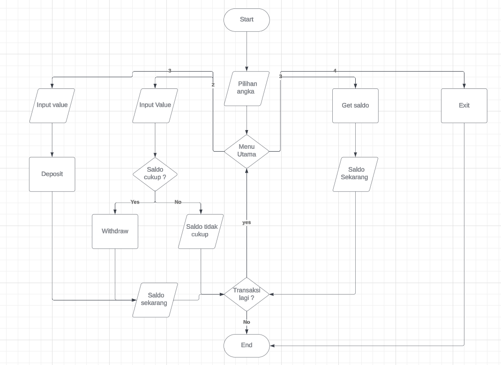
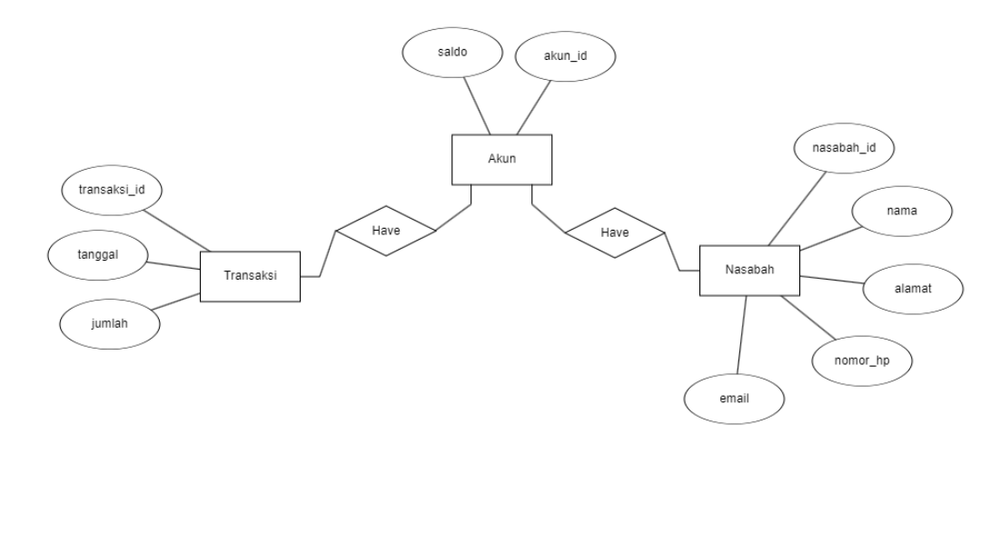
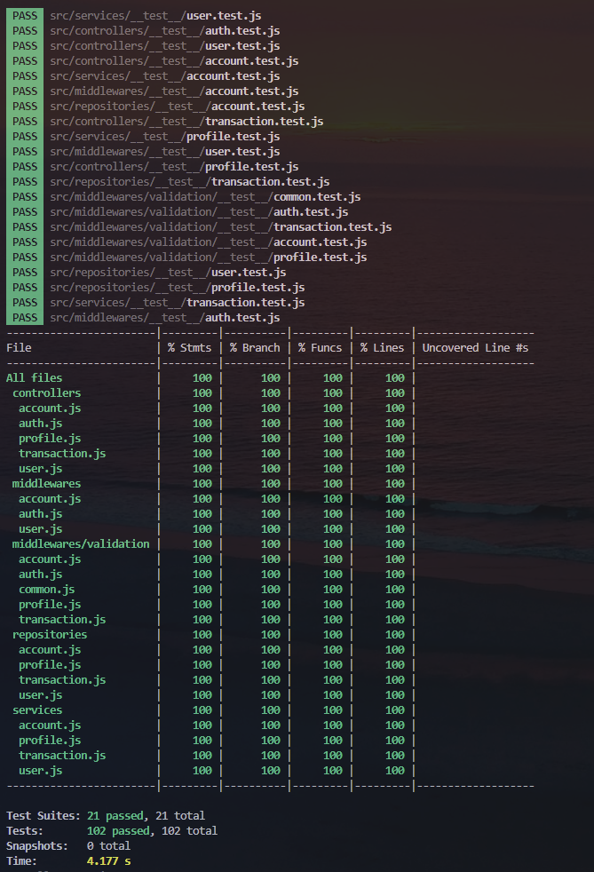

## Getting Started

How to run this project
```bash
npm i

edit your DATABASE_URL on .env file

npm run db:migrate
#or
npm run db:reset

npm run start
#or
npm start

Server is running on port http://localhost:3000
API documentation is available at http://localhost:3000/api-docs
```

## Flowchart


## ERD


## Test Coverage

